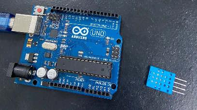
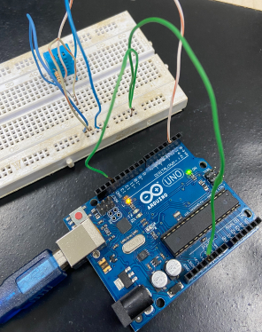
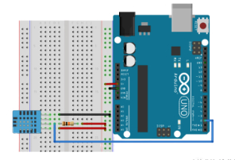
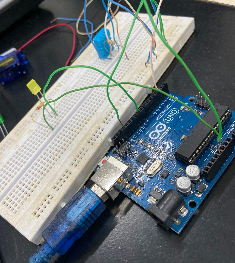
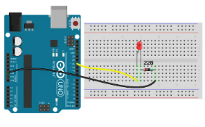
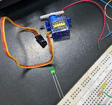
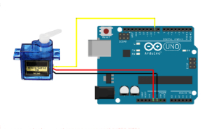

# Programação para Internet das Coisas
CURSO: TECNOLOGIA EM SISTEMAS PARA INTERNET

GRUPO: 
 FERNANDA BEATRIZ TAVARES GOMES

 POLIANA DE ARAUJO PEREIRA

TEMA: SISTEMA DE GERENCIAMENTO PARA FRUTAS E VERDURAS
# Projeto Iot
## Introdução (Fernanda)
Sabemos da importância em relação a boa alimentação, referente ao consumo de frutas e verduras no dia a dia. E também na produção, distribuição e exposição desses alimentos, nesse contexto esse trabalho tem o objetivo de fazer o controle e conservação das frutas e hortaliças, reduzindo assim questões de desperdício e melhorando as condições dos alimentos que chegam as nossas mesas.

As estimativas de perda, em países desenvolvidos, estão entre 5% e 25%, e para os países em desenvolvimento, estão entre 20% e 50%. Levantamentos indicam que
30% de tudo o que se produz em solo brasileiro deixa de ser aproveitado por causa de danos sofridos ao longo da cadeia produtiva. (LUENGO; CALBO, 2011)

## Justificativa

// Qualidade da solução: busque resolver de forma satisfatória e duradoura o problema com a técnica empregada considerando o contexto educacional vigente
// Potencial tecnológico comparativo: busque descrever detalhadamente as vantagens e desvantagens em relação as soluções similares existentes.
## Metodologia (Fernanda)

Dentre os materiais e métodos para o desenvolvimento, também realizamos pesquisas diversas referente a construção e implementação do dispositivo em arduino, como os componentes utilizados, conexões e códigos; e também sobre o tema a ser desenvolvido, a conservação de frutas e hortaliças, condições que interferem nesses alimentos, dados referentes a temperatura, umidade relativa e ventilação do ar.

Para a implementação do dispositivos utilizamos: 
- Arduino Uno
- Placa de Ensaio (Protoboard)
- Sensor DHT11 (Umidade e Temperatura)
- Leds (Amarelo e Verde)
- Servo Motor 
- Resistores (220Ohms e 10 k Ohms)
- Jumpers/fios (macho-macho)
- Cabo USB para Arduino

Na imagem a seguir, temos o dispositivo Arduino Uno que utilizamos e o sensor DHT11, que é a base do nosso projeto, para coleta de dados da temperatura e umidade, tendo uma faixa de temperatura entre 0ºC a 50ºC e de umidade relativa de 20% UR a 90% UR, e a conexão com cabo USB para carregar o programa apartir do computador.

Fizemos a montagem do DHT11 ao Arduino, com o protoboard, um resistor de 10k Ohms. O DHT11 possui 4 pinos, sendo eles: o primeiro (VCC), sendo ligado a alimentação da placa 5V. O segundo é o de dados, que conectamos ao resistor e também ao pino 2 do Arduino. o terceiro (NC) não é utilizado. e o quarto conectado ao terra (GND).

Utilizamos o modelo de conexão da imagem 2.

Iniciamos também a inserção dos leds ao projeto, para avisar quando a umidade relativa estiver baixa (led amarelo) e alta (led verde). não conseguimos fazer funciona-los devido ao tempo. 

Para a conexão dos leds, utilizamos um resistor de 220Ohms para cada led e fios macho-macho, igual o modelo abaixo.

Também faremos a inserção do Servo Motor, para ser utilizado apartir de dados da temperatura para o acionamento de algum dispositivo de refrigeração, ventilador ou ar-condicionado.

Para ligar o Servo Motor ao Arduino, temos três pinos, sendo eles: um para alimentação no pino de 5V do Arduino, outro para o terra (GND) e o ultimo para o pino 9 porta digital do Arduino. Seguindo o modelo abaixo.

## Conclusão

## Trabalhos Futuros
Conexão de dispositivo Arduino com aplicações Web, com protocolo MQTT, para exibição em dados coletados no dispositivo a um software (aplicativo), para implementação completo contendo dados e informações para o melhor gerenciamento das frutas e verduras.

## Referências 
Artigo: Sistema de monitoramento de umidade de solo via web. acesso em: https://hto.ifsp.edu.br/portal/images/thumbnails/images/IFSP/Cursos/Coord_ADS/Arquivos/TCCs/2018/TCC_HumbertoAntonioFerrisPereira_HT1320203.pdf

Artigo: Sistema IoT para Monitoramento de Temperatura e UmidadeAmbientes e Acionamento Remoto de Cargas. acesso em: https://sol.sbc.org.br/index.php/eripi/article/view/5173/5079

